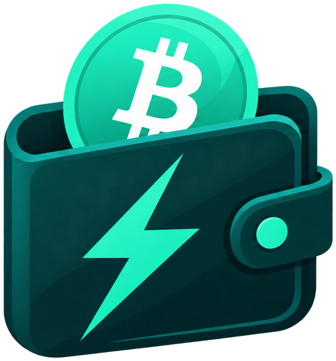
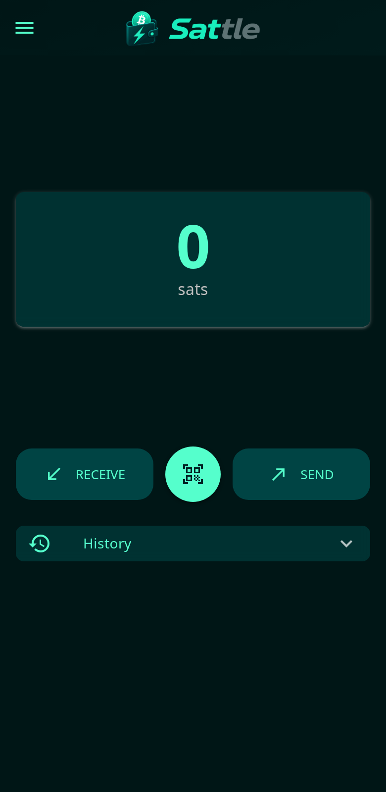
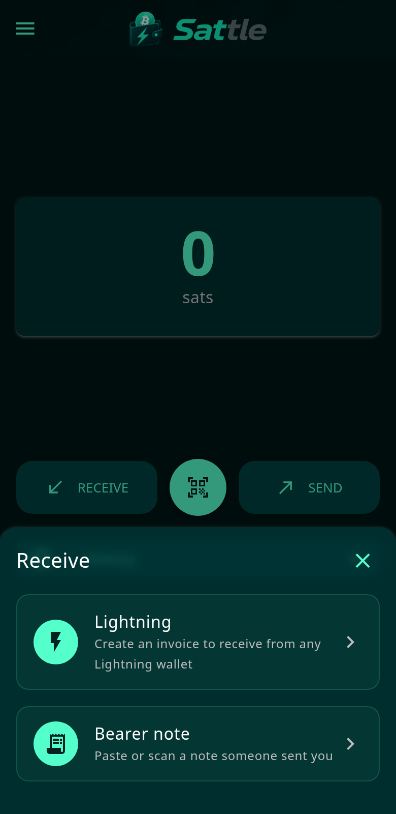
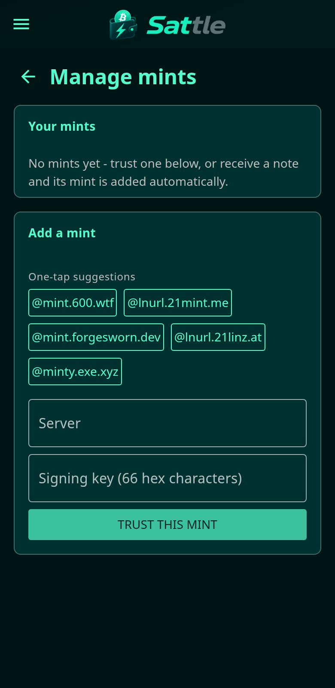

  
   
  

  A Lightning wallet that feels like handing someone cash.

  
  

---

## What is sattle?

sattle is a wallet for **Lightning bearer notes** (LNURLcash, LUD-25). A bearer
note is a link that _is_ the money: receive one and the sats are yours, send one
and they move — no invoices to request, no amounts to negotiate, no Lightning
jargon to learn. Receiving and sending takes seconds.

It's an installable web app (PWA) that works on any modern phone or desktop, with
an Android app wrapping the same experience. Built for people who just want to
send and receive.

  
  
  

## Highlights

- **Instant notes** — receive sats as a link or QR code; pass them on the same
  way. No invoice round-trips, no address book.
- **Mint trust, made visible** — notes are issued by mints you choose to trust.
  sattle pins each mint's signing key and asks you to review any key change
  before accepting it, so a mint can't quietly swap its identity.
- **Move funds between mints** — rebalance from one mint to another in a few
  taps.
- **Backups that fit your habits** — export an encrypted backup file, or let
  sattle keep an encrypted backup on nostr (kind 30078) that only you can read.
- **Passkey and biometric unlock** — open the wallet with your device's passkey
  or fingerprint. A password fallback is always available.
- **Connect other apps** — built-in Nostr Wallet Connect (NWC) service lets
  external apps pay from your wallet while sattle is open and unlocked, with
  per-connection budgets you control.

## How it works

sattle uses LNURLcash (LUD-25) bearer notes: each note is a URL that carries
spendable Lightning value. Your notes live **encrypted on your device** — the
underlying sats are held by the mints that issued the notes, so choosing and
reviewing mints is part of the model, and sattle surfaces that rather than
hiding it. Spend a note and the mint pays out over Lightning; receive one and
your wallet claims it instantly.

## For developers

sattle is a Quasar / Vue 3 PWA with a Capacitor Android wrapper (no signed
release yet). The protocol core is framework-free and lives in
[`src/lnurlcash/`](src/lnurlcash/). Contributor docs, architecture notes and
project conventions are in [AGENTS.md](AGENTS.md).
